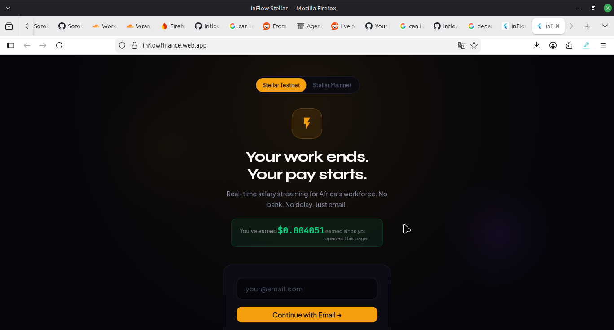
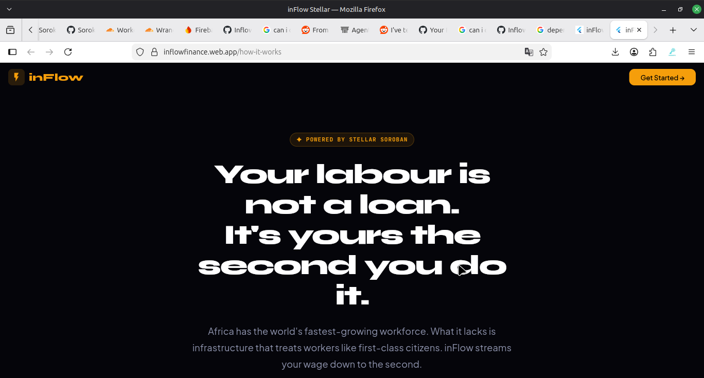
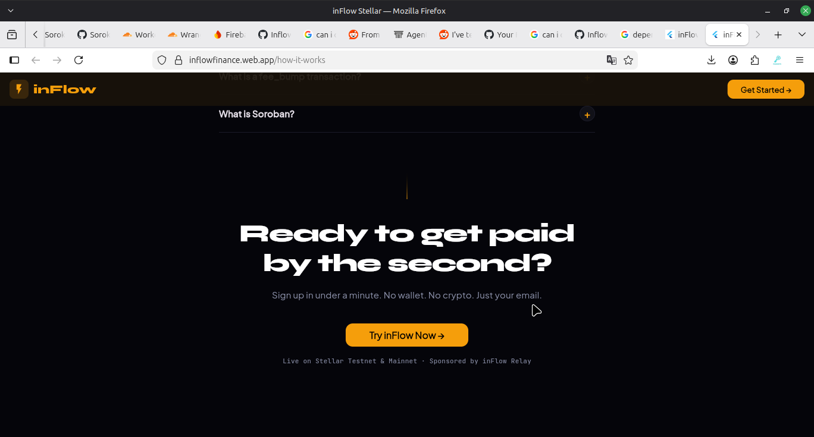

<div align="center">
  

  # ⚡ inFlow × Stellar
  ### *Real-Time Salary Streaming. Powered by Soroban.*

  [](https://stellar.org)
  [](https://soroban.stellar.org)
  [](#gasless-ux)
  [](LICENSE)
  [](https://github.com/InflowFinance/inflow-stellar/actions/workflows/ci.yml)

</div>

---

<div align="center">

### 🌍 Africa's First Salary Streaming Protocol on Stellar

*You work for a second. You earn for a second. That is what inFlow makes real.*

**[🚀 Live App](https://inflowfinance.web.app) · [📹 Demo](#demo) · [📖 How It Works](#how-it-works) · [🛠 Docs](ARCHITECTURE.md)**

</div>

---

## The Problem

**Across Africa, delayed wages are an epidemic.**

An employee works for 30 days, surrenders their full labour, and waits — hoping their employer pays on time, in full, without excuses. The ILO has formally described wage debt as *"another African epidemic."*

- **93% of Nigeria's workforce has no formal wage contract.** No receipts. No proof. No legal recourse.
- The average informal-sector worker in Africa waits **31–45 days** after earning their pay to receive it.
- Web3 was supposed to fix this — but existing crypto-payroll solutions demand wallets, seed phrases, browser extensions, and crypto fluency that leave the 3 billion unbanked people behind.

**inFlow solves all of it. At once.**

---

## 💡 The Solution

inFlow is a **trustless, per-second salary streaming protocol** built natively on **Stellar Soroban** — the most cost-efficient, ESG-compliant smart contract network on the planet.

Instead of a salary being an event that happens once a month, inFlow makes it **a continuous flow** — like electricity, like water. Your employer locks funds into a Soroban smart contract and your balance ticks upward every single second from the moment your pay period begins. You can withdraw any vested amount, any time, with one tap.

No wallet required. No seed phrase. No gas fees. No crypto knowledge. **Just your email address.**

> *"Your labour is not a loan. You earned it the moment you worked. inFlow makes sure you can access it that way."*

---

## 🌍 Africa's First Salary Streaming Service

Imagine opening an app right now and seeing the **exact amount you have earned** — down to the last millisecond.

Then tapping one button to have it in your pocket.

No waiting. No chasing. No asking.

That is inFlow.

We did not just build a payments app. We built a new way for workers and employers to relate to money — one where:

- ⚡ **You earn money the moment you work**, not weeks later
- 📧 **All you need is an email address** — no bank account, no crypto wallet, no financial history required
- 🔐 **The blockchain is invisible** — the experience is a simple email sign-in and a dashboard
- 💸 **You can collect your earnings any time** — no approval needed, no forms, no payday waiting
- ✉️ **Employers send a payment link** — works like a URL, employee opens it and is already funded
- 🌐 **Fees are zero for users** — the Cloudflare Worker treasury pays all Stellar network fees via `fee_bump`

This is Africa's first salary streaming service. It runs on Stellar. And it is open source.

---

## 📹 Demo

> **Live at [inflowfinance.web.app](https://inflowfinance.web.app)** — try the real app on Stellar Testnet with any email address.

### Landing Page



*The main entry point. Live earnings ticker shows USDC accumulating per-second. Stellar Testnet / Mainnet toggle. Email-only sign-in — no wallet, no seed phrase.*

### How It Works



*The story screen opens with the core thesis: your labour is not a loan. Africa has the world's fastest-growing workforce — inFlow is built for it.*



*Expandable FAQ section covering Soroban, fee_bump, and stream security. Bottom CTA drives conversion back to the app.*

---

## How It Works

### 1 — Employer signs in with email
No wallet setup. No seed phrase. No browser extension. Just an email address. Our Cloudflare Worker derives a deterministic Ed25519 keypair from their email using HKDF with a server-side master key. The keys are encrypted and stored in Cloudflare KV. The user sees a 6-digit OTP inbox — nothing else.

### 2 — Employer creates a salary stream
The employer deposits USDC into the **InFlow Soroban contract** (`create_stream`). They set a recipient (an address, or a SHA-256 claim hash for email recipients who haven't joined yet). The contract begins accruing balance per second:

```
rate_per_second = deposit / duration_in_seconds
unlocked_balance = rate_per_second × elapsed_seconds
```

### 3 — Employer sends a payment link
The contract stores a `claim_hash` (SHA-256 of a one-time secret). The employer sends the employee a URL containing that secret — looks like any normal link. The employee does not need to know what Soroban is.

### 4 — Employee opens the link, signs in with email
The employee opens the link on any device, enters their email, receives a 6-digit OTP in their inbox. Our Worker verifies the OTP and derives their Ed25519 keypair silently. They land on a live dashboard showing their salary ticking upward in real time.

### 5 — Employee claims and withdraws anytime
On first open, `claim_stream` is called — the contract verifies the SHA-256 secret and assigns the keypair address as recipient. From that point forward, `withdraw` can be called at any time to collect all vested USDC to their address. All transactions are fee-bumped by our treasury. **The employee pays zero Stellar fees. Ever.**

---

## The Gasless UX

> *"Business up front, party in the back."*

The user sees a `Collect Earnings` button. Behind it:

```
Employee taps "Collect" →
  Worker builds Soroban withdraw() transaction
  Worker wraps in fee_bump (treasury pays fee)
  Stellar network settles in ~5 seconds
  ← Employee sees "+$143.22 collected" ✓
```

No protocol-hopping. No bridging. No gas management. **One button. Full Soroban in the background.**

---

## Why Stellar?

| Property | Stellar | EVM (Base, Injective) |
|---|---|---|
| **Transaction fee** | ~0.00001 XLM (~$0.000003) | $0.01–$2.00 |
| **Finality** | ~5 seconds | 12–60 seconds |
| **fee_bump support** | ✅ Native protocol feature | ❌ Requires meta-transactions |
| **ESG / Carbon** | ✅ Carbon-neutral, PoA | ❌ High energy (PoW chains) |
| **USDC** | ✅ Native Circle issuance | ✅ Bridged USDC |
| **Soroban** | ✅ WASM smart contracts (Rust) | EVM Solidity |

Stellar's `fee_bump` envelope is the single most powerful feature for consumer crypto UX — it lets our treasury pay all user fees at the protocol level, invisibly. No relayer hacks, no EIP-2771, no wrapper contracts. It just works.

---

## 🏗️ Architecture

```
┌─────────────────────────────────────────────────────────────┐
│                     USER (Email only)                       │
│              iOS · Android · Web Browser                    │
└──────────────────────────┬──────────────────────────────────┘
                           │  HTTP (OTP, keypair auth)
                           ▼
┌─────────────────────────────────────────────────────────────┐
│              Cloudflare Worker Relay                        │
│   /send-otp       → HMAC-SHA256 OTP via Resend Email       │
│   /verify-otp     → HKDF keypair derivation + KV store     │
│   /fee-bump       → Wraps user XDR in fee_bump envelope    │
│   /stream-info    → Reads stream link metadata from KV     │
│   /store-stream-secret → Saves stream claim metadata       │
└──────────────────────────┬──────────────────────────────────┘
                           │  Soroban RPC
                           ▼
┌─────────────────────────────────────────────────────────────┐
│                 InFlow Soroban Contract                     │
│                  (Rust, wasm32v1-none)                      │
│                                                             │
│   initialize()         → Set admin, seed stream counter     │
│   create_stream()      → Lock USDC, set rate_per_second     │
│   claim_stream()       → SHA-256 secret → assign recipient  │
│   withdraw()           → Transfer vested USDC to recipient  │
│   cancel_stream()      → Pro-rata split back to both sides  │
│   extend_stream_ttl()  → Touch-on-read TTL renewal         │
│   get_stream()         → Read stream state                  │
│   unlocked_balance()   → Real-time accrued balance         │
└──────────────────────────┬──────────────────────────────────┘
                           │  SAC (Stellar Asset Contract)
                           ▼
            ┌─────────────────────────────┐
            │  USDC Token (Circle / SAC)  │
            └─────────────────────────────┘
```

---

## 🛠️ Technology Stack

| Layer | Technology | Purpose |
|---|---|---|
| **Smart Contract** | Rust (`wasm32v1-none`) on Soroban | Core streaming logic, per-second math, SHA-256 claim gates |
| **Backend** | Cloudflare Workers (TypeScript) | Email OTP, HKDF keypair custody, `fee_bump` relay |
| **SDK** | TypeScript (`@inflow/sdk`) | Thin client over Soroban RPC + Worker API |
| **Web App** | Flutter Web + `StellarBridge.js` | Responsive PWA with live earnings ticker |
| **Mobile App** | Flutter (iOS + Android) | Native app with biometric auth and QR streaming |

---

## 📂 Repository Layout

```
inflow-stellar/
├── contracts/
│   └── inflow/src/
│       ├── lib.rs          # Contract entrypoints (create_stream, withdraw, cancel…)
│       ├── math.rs         # Per-second accrual and cancellation split math
│       ├── storage.rs      # Persistent storage helpers + touch-on-read TTL
│       ├── types.rs        # Stream struct, StorageKey enum
│       ├── events.rs       # Soroban event emission
│       └── errors.rs       # ContractError enum
├── workers/src/
│   ├── index.ts            # Cloudflare Worker router + all request handlers
│   ├── otp.ts              # HMAC-SHA256 time-windowed OTP generation
│   ├── keypair.ts          # HKDF deterministic keypair derivation + AES-GCM encryption
│   └── fee_bump.ts         # Stellar fee_bump envelope wrapping
├── sdk/                    # @inflow/sdk TypeScript client
├── apps/web/               # Flutter Web PWA
├── mobile/lib/
│   ├── main.dart           # App entry, theme, router
│   ├── models/             # Stream, User, OtpState data classes
│   ├── providers/          # AppProvider (ChangeNotifier state management)
│   ├── screens/            # Landing, Dashboard, Employer, Stream Detail
│   ├── services/           # StellarService (Worker API), StorageService
│   └── widgets/            # LiveEarningsTicker, StreamCard, GradientButton…
├── scripts/                # deploy.sh, demo.sh, setup.sh
├── docs/                   # System architecture runbook
└── .github/                # CI workflows, issue templates, CODEOWNERS
```

---

## 📑 Deployed Contracts

| Network | Contract ID | Explorer |
|---|---|---|
| **Stellar Testnet** | `CCCFBMNEBOV7KTVWLEBR2FFUGQC4KSL5TSITVU5ZPQ2U3PNLQJGX62W2` | [Stellar Expert Testnet](https://stellar.expert/explorer/testnet/contract/CCCFBMNEBOV7KTVWLEBR2FFUGQC4KSL5TSITVU5ZPQ2U3PNLQJGX62W2) |
| **Stellar Mainnet** | *Coming after audit* | — |

> **Note for maintainers:** Run `scripts/deploy.sh testnet` to deploy, then update this table and `contracts/Soroban.toml` with the returned contract ID.

---

## 🚀 Quick Start

### Prerequisites

```bash
# Rust + WASM target
curl --proto '=https' --tlsv1.2 -sSf https://sh.rustup.rs | sh
rustup target add wasm32v1-none

# Stellar CLI
cargo install --locked stellar-cli --features opt

# Node.js 20+ and Flutter 3.x
node --version   # ≥ 20
flutter --version
```

### Bootstrap

```bash
git clone https://github.com/InflowFinance/inflow-stellar.git
cd inflow-stellar
npm install

# Build and test the Soroban contract
cd contracts
cargo test

# Run the Cloudflare Worker locally
cd ../workers
npm run dev

# Run the Flutter Mobile app
cd ../mobile
flutter pub get
flutter run
```

### Deploy the Contract

```bash
cd contracts
stellar contract build
stellar contract deploy \
  --wasm target/wasm32v1-none/release/inflow.wasm \
  --network testnet \
  --source-account your-deployer-account
```

---

## 🤝 Contributing

inFlow is built in the open. Community contributions are the heartbeat of this project.

Please read [CONTRIBUTING.md](CONTRIBUTING.md) for code standards, testing requirements, and how to submit PRs. See [GOVERNANCE.md](GOVERNANCE.md) for the project's decision-making process.

**Good first issues are tagged** [`good-first-issue`](https://github.com/InflowFinance/inflow-stellar/issues?q=is%3Aissue+label%3Agood-first-issue) in the issue tracker.

---

## 🗺️ Roadmap

- [x] Soroban smart contract — core streaming, claim, cancel, withdraw
- [x] Cloudflare Worker — email OTP, HKDF keypair custody, fee_bump relay
- [x] TypeScript SDK (`@inflow/sdk`)
- [x] Flutter Web app (PWA) — live at [inflowfinance.web.app](https://inflowfinance.web.app)
- [x] Flutter Mobile app (iOS + Android)
- [x] Open-source health files (README, CONTRIBUTING, ARCHITECTURE, ROADMAP, GOVERNANCE, SECURITY, CHANGELOG)
- [x] GitHub Actions CI pipeline (Rust check / clippy / WASM build / SDK build)
- [ ] Testnet contract deployment + live contract ID
- [ ] Mainnet contract deployment + security audit
- [ ] Employer dashboard — multi-stream management, CSV payroll upload
- [ ] Real-time push notifications (stream claimed, funds deposited)
- [ ] Fiat off-ramp via Stellar Anchor / MoneyGram Access
- [ ] DAO governance for protocol fee parameters

---

## 📄 License

Distributed under the **Apache 2.0 License**. See [LICENSE](LICENSE) for full terms.

---

<div align="center">

Built with ❤️ for Africa's workforce. Powered by Stellar.

*"If you can receive email, you can receive your salary."*

</div>
