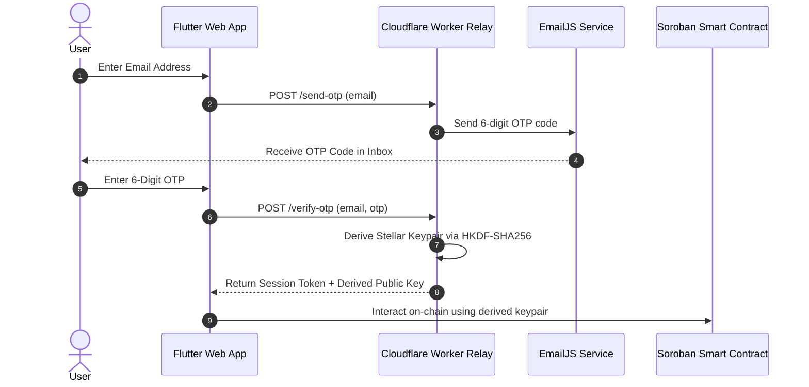
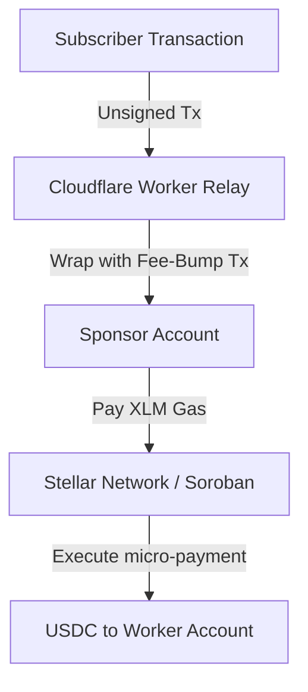
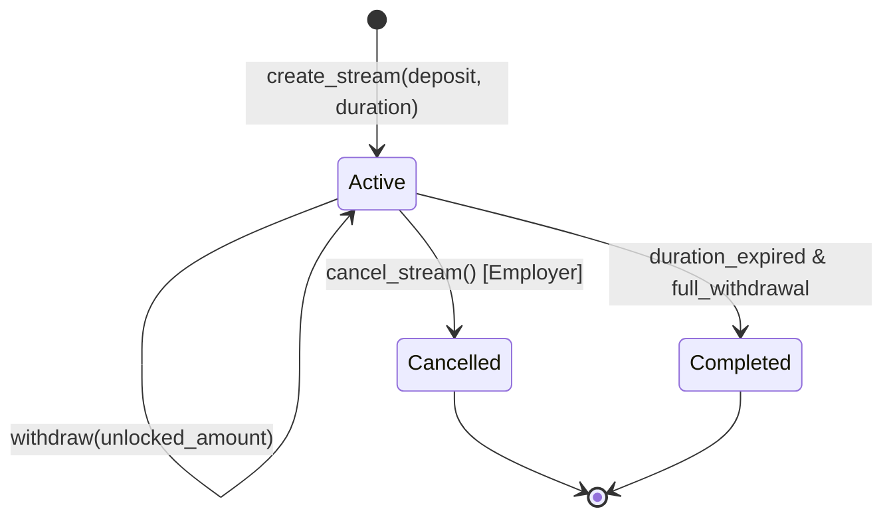

# 🏗️ inFlow Stellar System Architecture

This document details the end-to-end technical architecture, cryptographic key management, gas sponsorship model, and Soroban smart contract lifecycle of **inFlow Stellar**.

---

## 🔑 1. Passwordless Non-Custodial Auth (HKDF Key Derivation)

Traditional Web3 UX forces users to manage seed phrases or install browser wallets (e.g. Freighter, Albedo). In contrast, inFlow delivers an **email-first experience** while retaining 100% non-custodial ownership.

### Cryptographic Key Derivation Flow
1. User authenticates via 6-digit Email OTP.
2. Cloudflare Worker verifies the OTP session secret.
3. Master seed + User Email + Session Salt is passed to **HKDF-SHA256**.
4. The output 32-byte secret key generates an ed25519 **Stellar Keypair** (`G...`).
5. Keypair is returned to local memory storage only—no private keys are stored on server databases.

---

## ⛽ 2. Stellar Gas Sponsorship (`fee_bump` Protocol)

African workers should not have to acquire native XLM tokens just to pay transaction gas fees when collecting their earned USDC salary.

### Fee Sponsorship Steps
1. The worker's client builds an unsigned Soroban invocation transaction (`withdraw` / `claim`).
2. Transaction payload is posted to `https://inflow-relay.zapstream.workers.dev/sponsor`.
3. Cloudflare Worker wraps the inner transaction in a Stellar `FeeBumpTransaction`.
4. Sponsor wallet signs as the fee payer in XLM.
5. Inner transaction executes on Soroban using the worker's keypair—zero XLM deducted from worker account.

---

## 📜 3. Soroban Stream State Machine

### Stream States & Invariants
- **Active**: Stream created, funds locked in Soroban contract vault. `unlocked_amount = (current_time - start_time) * rate_per_second`.
- **Withdrawal**: Recipient can call `withdraw()` anytime for `min(unlocked_amount - withdrawn_amount, remaining_balance)`.
- **Cancellation**: Employer can call `cancel_stream()`. Unearned funds revert to employer; 100% of unlocked earnings up to `cancel_time` remain withdrawable by employee.

---

## 🛡️ 4. Security Principles

1. **Non-Custodial Enforcement**: Soroban smart contract holds all stream funds. inFlow operators cannot access locked balances.
2. **Reentrancy Protection**: State updates (`withdrawn_amount += payout`) occur prior to token transfers.
3. **Atomic Operations**: Stream creation, deposit transfers, and state mutations execute atomically in a single ledger transaction.
